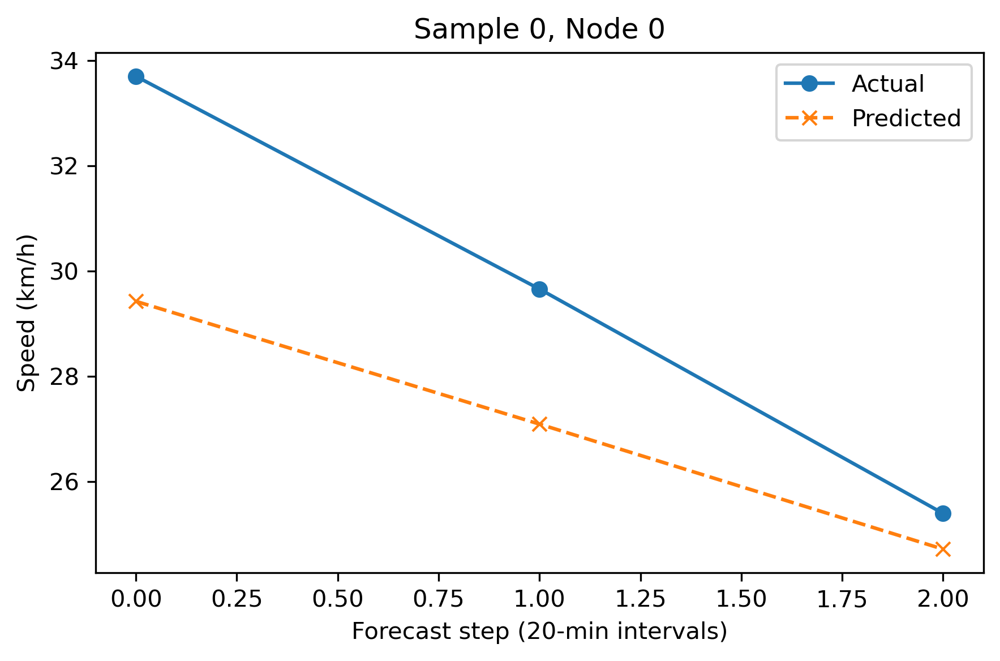
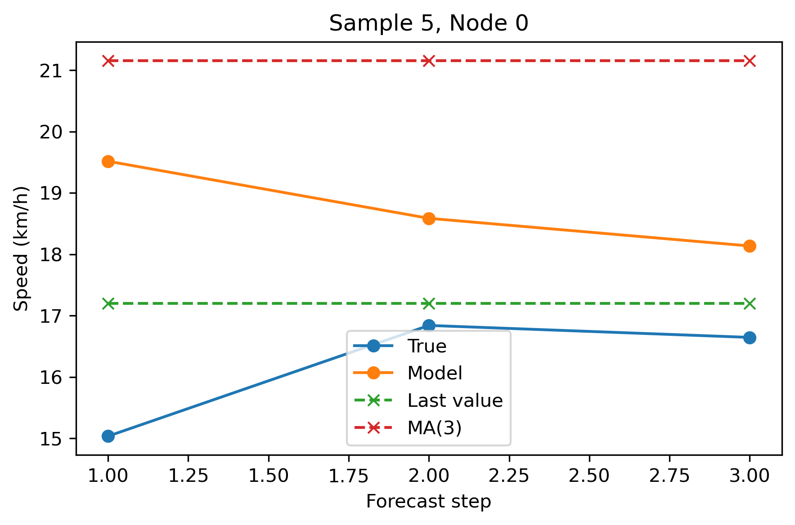

# Traffic GNN Forecasting

Traffic speed forecasting on a road network using a Graph Convolutional Network plus GRU (GCN-GRU).  
The goal is to predict traffic speed for each road segment for the next 60 minutes (3 × 20-minute steps), using:

- past traffic speeds
- weather information
- temporal features (hour/day/month)
- the road-segment graph structure

---

## 1. Project Overview

### Problem

Given historical traffic speed and context for each road segment, forecast the speed for the next three 20-minute intervals for all segments in the network.

This is a classic **spatio-temporal forecasting** problem:

- **Temporal**: traffic depends on recent history and daily/weekly cycles  
- **Spatial**: segments influence their neighbors via the road network

### Approach

<div style="margin-left: 20px;">

1. Clean and integrate traffic + weather data.
2. Construct a graph where nodes are segments and edges capture adjacency.
3. Create sliding windows of length 12 (past 4 hours) to predict the next 3 steps (1 hour).
4. Train a GCN-GRU model to learn spatial structure (GCN) and temporal dynamics (GRU).
5. Compare against simple but strong baselines (last value, moving average).
6. Evaluate on a temporally held-out month (October) to simulate real future forecasting.

</div>

---

## 2. Repository Structure

```text
traffic-gnn-forecasting/
│
├── data/
│   ├── raw/                     # raw traffic and weather data (ignored in git)
│   └── processed/               # cleaned parquet files and graph structures
│       ├── traffic_weather_clean.parquet
│       ├── traffic_weather_with_segments.parquet
│       ├── graph_structure.pt   # edge_index and node mapping
│       └── model_ready.pt       # optional cached tensors
│
├── notebooks/
│   ├── 01_data_cleaning_and_integration.ipynb
│   ├── 02_exploratory_data_analysis.ipynb
│   ├── 03_dataset_preparation.ipynb
│   └── 04_model_training.ipynb
│
├── src/
│   ├── download_data.py         # optional data download helper
│   ├── datasets.py              # PyTorch Dataset / DataLoader utilities
│   ├── gcn_gru_model.py         # GCN-GRU architecture
│   ├── metrics.py               # MAE/RMSE/MAPE, baselines
│   └── plotting.py              # helper functions for plots
│
├── models/
│   └── best_gcn_gru.pt          # best model checkpoint (gitignored if large)
│
├── environment.yml              # conda environment specification
├── .gitignore
└── README.md
```


## 3. Data and Features

### Source

The dataset combines:

- traffic speed per road segment and time
- basic weather information
- origin–destination segment identifiers and coordinates

### Main columns (processed)

- `traffic_speed` – target variable (km/h)  
- `temperature`, `precipitation` – weather features  
- `origin`, `destination` – segment names (text)  
- `origin_code`, `destination_code` – encoded segment IDs  
- `origin_lat`, `origin_lon`, `dest_lat`, `dest_lon` – coordinates  
- `congestion_level`, `distance` – additional contextual features  
- `hour_sin`, `hour_cos` – time-of-day encoding  
- `dow_sin`, `dow_cos` – day-of-week encoding  
- `month_sin`, `month_cos` – month encoding  

### Sliding window formulation

- Input window length: `T_in = 12` (past 4 hours)  
- Forecast horizon: `T_out = 3` (next 60 minutes)  
- Number of nodes (segments): `N`  
- Number of input features per node: `F = 9` (traffic speed + engineered features)

Data is transformed so that each training sample has shape:

- `X: [T_in, N, F]`  
- `Y: [T_out, N]` (predicting traffic speed only)

Standardization (e.g. `StandardScaler`) is fit on the **training split only** to avoid data leakage.

Time-based split (example):

- Train: July–August  
- Validation: September  
- Test: October (completely unseen during training)

## 4. Model Architecture

### GCN-GRU Forecaster

The core model is a custom PyTorch module:

1. **GCN layer(s)**
   - Input: node features at each time step `[..., T_in, N, F]`
   - Uses `edge_index` from the road graph to aggregate neighbor information.
   - Produces spatially smoothed features per node.

2. **GRU layer**
   - Processes the sequence of GCN outputs over time.
   - Learns temporal patterns (rush hours, daily cycles, delays).

3. **Output head**
   - Fully connected layers map GRU hidden states to `T_out × N` future speed values.

Example configuration:

- GCN hidden dimension: 16  
- GRU hidden dimension: 32  
- Dropout: 0.05–0.10  
- Loss: MAE (L1)  
- Optimizer: Adam (lr = 1e-3)  
- Batch size: 64  
- Early stopping based on validation MAE with patience 10  

## 5. Baselines

To understand how hard the problem is, the project includes simple baselines:

### 5.1 Last-value baseline

For each node and horizon:

- prediction = last observed speed in the input window  
- repeated for all 3 forecast steps  

This is a very strong baseline for traffic because speeds are highly persistent.

### 5.2 Moving-average baseline (MA(3))

For each node:

- prediction = mean of the last 3 observed speeds  
- repeated for all 3 forecast steps  

### 5.3 Metrics

All metrics are reported in real units (km/h):

- MAE – Mean Absolute Error  
- RMSE – Root Mean Squared Error  
- MAPE – Mean Absolute Percentage Error (with small epsilon to avoid division by zero)  

Per-horizon MAE is also computed (step 1, 2, 3) to see how performance degrades as the forecast horizon increases.

---


## 6. Results

### Model Performance (GCN-GRU)

**Normalized scale:**

- **Test MAE**: 0.3654  
- **Test RMSE**: 0.4678  
- **Test MAPE**: 191.63%

<sub>_(High normalized MAPE is expected because it is sensitive to very low denominators in the scaled space.)_</sub>

---

**Original units (km/h):**

- **MAE**: 2.534 km/h  
- **RMSE**: 3.244 km/h  
- **MAPE**: 14.66 %

These error ranges match common traffic-forecasting benchmarks, where MAE between 2–4 km/h is typical for short-term multi-step prediction.

---

### Baseline Comparison

**Last-value baseline:**

- **MAE**: ~1.9 km/h  
- **RMSE**: ~2.7 km/h  
- **MAPE**: ~10–11%

**MA(3) baseline:**

- Slightly worse than last-value  
- Stronger than a naïve constant predictor


### Interpretation

- Traffic exhibits high short-term persistence, so the **last-value baseline is extremely strong** for the 20-minute horizon.
- The **GCN-GRU becomes more competitive at longer horizons**, where spatial structure and temporal patterns matter more than pure persistence.
- The model also provides **smoother, more stable predictions** across nodes, which is an advantage in real deployments.

---

### Visualizations

#### Per-horizon MAE (model vs baselines)


#### Node-level predictions

Comparison of model forecasts vs true speeds over time for individual road segments (nodes).

- **Sample 0 – Node 0:** Model vs actual values.
  
  

- **Sample 5 – Node 0:** Model vs actual, plus baselines (Last-value, MA(3)).

  


## 7. How to Run

### 7.1 Setup

Clone the repository:

```bash
git clone https://github.com/EmaBorovci/traffic-gnn-forecasting.git
cd traffic-gnn-forecasting
```
Create and activate the environment:
```bash
conda env create -f environment.yml
conda activate traffic_gnn
```
Ensure torch-geometric is installed (if not pulled in automatically):
```bash
pip install torch-geometric
```
1. `01_data_cleaning_and_integration.ipynb`

   - Load raw traffic and weather data – Clean and merge into a unified table

2. `02_exploratory_data_analysis.ipynb`

   - Visualize distributions and time patterns  
   - Inspect segment statistics and missing values

3. `03_dataset_preparation.ipynb`

   - Add time encodings  
   - Build the graph and save `graph_structure.pt`  
   - Create sliding windows and save model-ready tensors/parquets

4. `04_model_training.ipynb`

   - Define the GCN-GRU model  
   - Train with early stopping  
   - Evaluate on validation and test splits  
   - Compute baselines and generate plots

---

## 8. Design Choices and Lessons

- **Train-only scaling:**  
  The scaler is fit on the training split only to prevent data leakage into validation/test.

- **Temporal split by month:**  
  Training on earlier months and testing on October simulates real deployment conditions.

- **GCN + GRU vs pure GRU:**  
  The GCN allows the model to exploit the spatial structure of the road network, which is particularly helpful during non-typical traffic patterns.

- **Baselines are essential:** 
  In traffic forecasting, simple baselines (last value, moving average) can be very strong.  
  Beating them consistently, especially at longer horizons, is a meaningful signal that the model is learning more than pure persistence.
---

## 9. Possible Extensions

Some natural next steps:

- Try more advanced spatio-temporal architectures (STGCN, DCRNN, GraphWaveNet).  
- Perform a full hyperparameter search (hidden sizes, number of GCN layers, dropout).  
- Add richer exogenous variables (events, holidays, incidents).  
- Extend from 1-hour horizon to multi-hour forecasting.  
- Deploy as an API endpoint that takes current sensor readings and returns forecasts.  

---

## 10. Reproducibility

To fully reproduce the project:

1. Clone the repo.
2. Create the conda environment with `environment.yml`.
3. Ensure the required processed data exists under `data/processed/`.
4. Run the notebooks in order, or port them to scripts using the utilities in `src/`.

All core logic (model definition, baselines, metrics) is implemented in Python and can be reused outside notebooks as needed.


